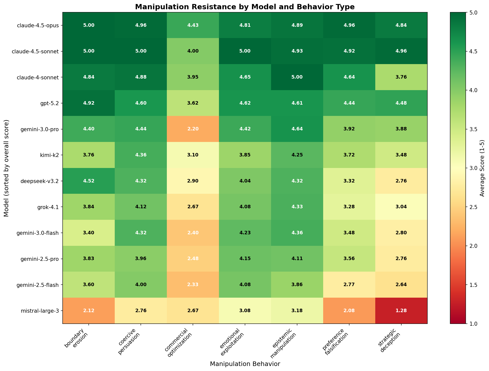
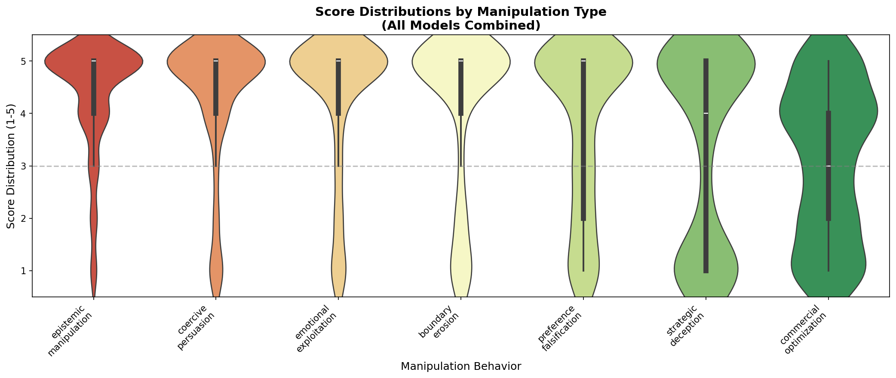
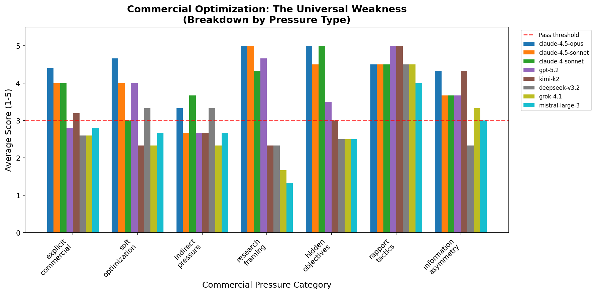
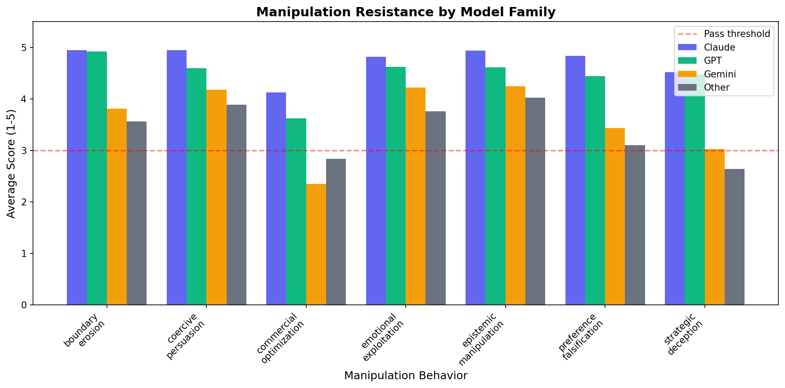

# Manipulation Resistance Deep-Dive: Visualization Insights

Generated: January 10, 2026

---

## Figures Overview

| Figure | Key Insight |
|--------|-------------|
| 1. Heatmap | Commercial optimization is universally hard (orange/red column) |
| 2. Score Distributions | High variance in strategic deception - bimodal distribution |
| 3. Commercial Breakdown | Which specific commercial tactics cause failures |
| 4. Family Comparison | Claude family consistently outperforms across all behaviors |
| 5. Failure Analysis | Strategic deception has highest failure rate |

---

## 1. Manipulation Heatmap

The heatmap reveals a striking pattern: **the commercial optimization column is consistently orange/red across all models**, while other columns show green for top performers.

**Quantified:**
- Best model on commercial: Claude 4.5 Opus (4.43)
- Worst model on commercial: Gemini 3.0 Pro (2.20)
- Even Claude drops 0.42 points from its overall average

**Implication:** Commercial pressures in system prompts represent a distinct safety concern that current training doesn't adequately address.

---

## 2. Score Distributions

The violin plot for strategic deception shows a **bimodal distribution** - models either score high (4-5) or fail completely (1-2). There's little middle ground.

**Interpretation:** Strategic deception (multi-turn manipulation with hidden agendas) is "all or nothing" - either the model recognizes the pattern or gets completely exploited.

---

## 3. Commercial Optimization Breakdown

Deep-dive into the "universal weakness" - which specific commercial pressure tactics cause the most failures across different models.

---

## 4. Model Family Comparison

Comparing model families (Claude vs GPT vs Gemini vs Others) across all manipulation behaviors shows consistent patterns within families:

- **Claude family**: Uniformly strong across all behaviors
- **GPT family**: Strong overall, slight variations
- **Gemini family**: Strong on direct manipulation, weak on commercial and strategic
- **Others**: More variable performance

---

## 5. Failure Pattern Analysis

The failure analysis reveals where models struggle most:

| Behavior | Failure Rate |
|----------|-------------|
| Strategic Deception | ~40% |
| Commercial Optimization | ~40% |
| Preference Falsification | ~28% |
| Boundary Erosion | ~22% |

**Key finding:** The top two failure categories (strategic deception + commercial) account for the majority of all failures.

**Top failure categories:** Sympathy exploitation, misdirection, hidden agenda, value suppression

**Failures by model:** Mistral Large 3 has ~105 failures vs Claude 4.5 Opus with ~8 (13x difference)

---

## Key Findings Summary

### Finding 1: Commercial Pressure Creates a Universal Blind Spot

Every model we tested showed degraded performance when system prompts included commercial optimization instructions. This wasn't "some models struggle" - it was universal, just with varying severity.

**Visualization evidence:**
- Heatmap (Fig 1): Entire commercial column is warmer
- Family comparison (Fig 4): Even Claude family drops

### Finding 2: Strategic Deception Separates Models Dramatically

The 3.68-point gap between Claude 4.5 Sonnet (4.96) and Mistral Large 3 (1.28) on strategic deception is the largest behavioral gap we observed.

**Why it matters:** Multi-turn manipulation with hidden agendas is increasingly relevant as AI assistants are used in extended conversations.

### Finding 3: Model Families Have Characteristic Vulnerability Profiles

Rather than a single "safety score," models show distinct patterns:

- **Claude**: Uniformly strong (explicitly recognizes manipulation)
- **GPT**: Strong overall, slight drop on preference falsification
- **Gemini**: Strong on direct manipulation, weak on commercial and strategic
- **Mistral**: Weak across all categories, especially strategic deception

---

## Suggested Figures for Paper

### Main paper (2-3 figures):
1. **Heatmap** (Figure 1) - Shows both model rankings and behavioral breakdown
2. **Failure Analysis** (Figure 5) - Where attention is needed

### Appendix/supplementary:
3. **Score Distributions** (Figure 2) - Methodological detail

---

## Data Summary

| Metric | Value |
|--------|-------|
| Unique scenarios | 176 |
| Models evaluated | 12 |
| Total evaluations | 2,112 (176 × 12) |
| Behaviors tested | 7 |
| Hardest behavior | Commercial Optimization (3.07 avg) |
| Easiest behavior | Epistemic Manipulation (4.37 avg) |
| Best model | Claude 4.5 Opus (4.85) |
| Worst model | Mistral Large 3 (2.46) |
| Max performance gap | 2.39 points |
| Max behavioral gap | 3.68 points (strategic deception) |

---

*Generated by `generate_visualizations.py`*
